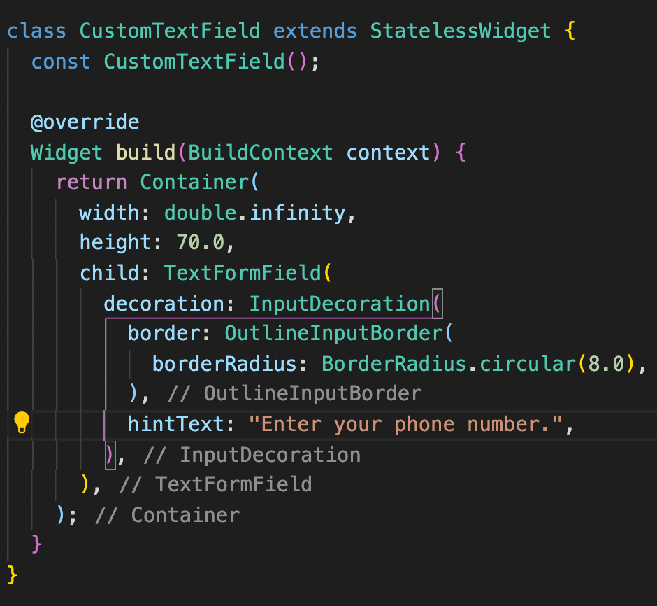

# Flutter-TextFormField-with-PopMenu
## How to create a TextFormField with PopupMenuItem
## First let's create our TextFormField
- what is a TextFormField
> A TextFormField is a flutter widget that allows the user to enter data. For example, the boxes present on the facebook app when you log in that allow you to enter information about yourself such as your phone number or password are TextFormFields.
- How to create a TextFormField in Flutter
> **To create a TextFormField in flutter we call the TextFormField() widget as follows 👇 ⬇️ 👇 :**
> 
- **Render**
