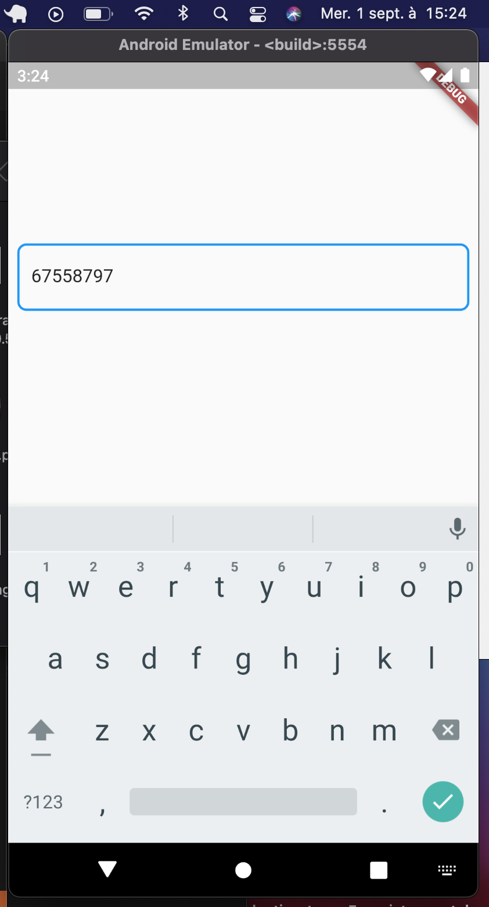
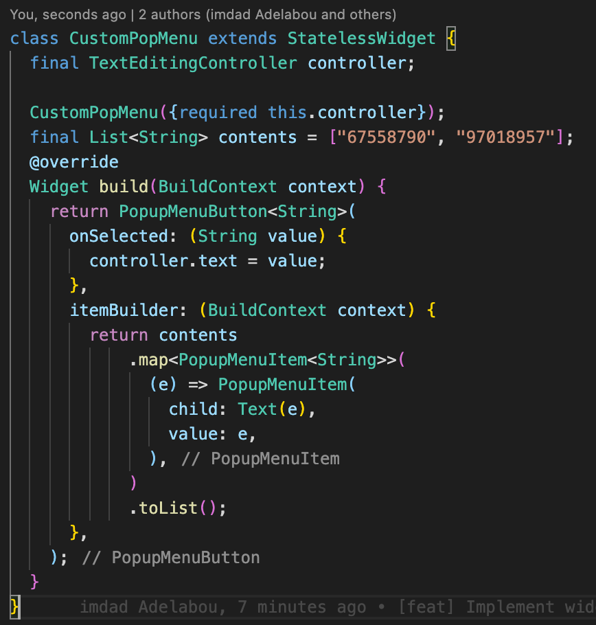
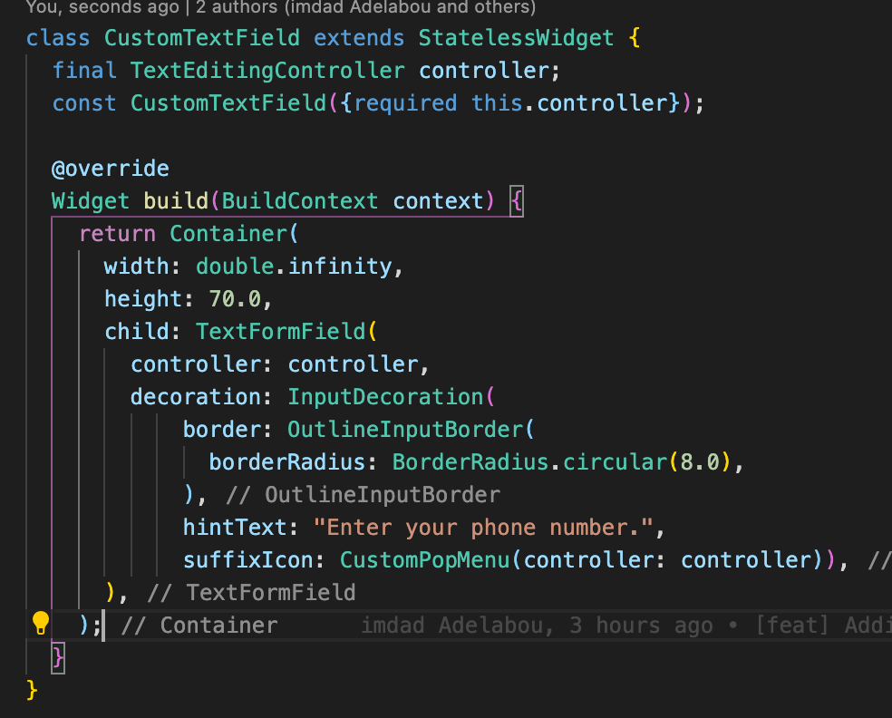
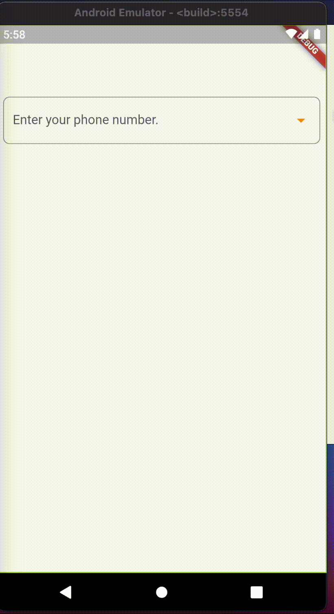

# Flutter-TextFormField-with-PopMenu
## How to create a TextFormField with PopupMenuItem
## First let's create our TextFormField
- what is a TextFormField
> A TextFormField is a flutter widget that allows the user to enter data. For example, the boxes present on the facebook app when you log in that allow you to enter information about yourself such as your phone number or password are TextFormFields.
- How to create a TextFormField in Flutter
> **To create a TextFormField in flutter we call the TextFormField() widget as follows 👇 ⬇️ 👇 :**
> 
- **Render**
> \
> The TextFormField has a number of properties that define the look and feel of the widget.
> For example we have these different properties 👇👇:
1. controller
    - To manage the content of the TextFormField
    - With **controller.text** we can retrieve the content entered by the user
2. border
    - Apply a border type to the TextFormField
3. hintText
    - Allows you to enter a predefined text to guide the user to the expected value
4. Go into detail about the different properties of the TextFormField by following this link [https://api.flutter.dev/flutter/material/TextFormField-class.html]

## Let's go back to the essentials and build our PopMenu
>To build a PopMenu we make use of the PopupMenuButton() widget by implementing it this way 👇👇👇:
> 

1. itemBuilder
    - A function that expects a List<PopupMenuItem<String>>, in a simple way the content of the PopMenuButton
    - So what we do is we just convert a List of strings into a List of PopMenuItem
2. onSelected
    - retrieves the value selected by the user from the list of values and add it directly to the TextFormField using the widget controller.
    
3. Icon
    - To make an icon representation of the PopupMenu when it is not active
## Well done we have come such a long way, we have just created the component for our PopupMenu so let's choose where to place it in our TextFormField
> Personally I would put it in the **suffixIcon** property of the TextFormField like this 👇👇👇👇:
> 
## Final Render
> 
## Thanks for reading, don't hesitate to put a star if you liked it.
## 😇 Author(s)
**Imdad Adelabou** 
